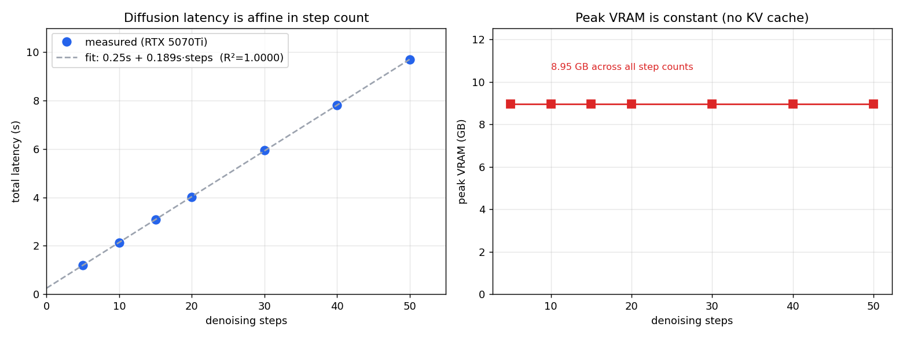
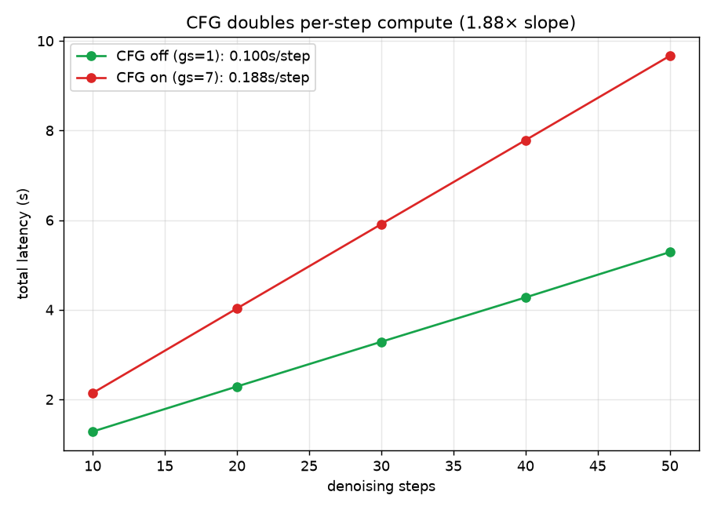

# diffusion-inference-profiling

在单张消费级 GPU 上对**扩散模型推理负载**做的实证刻画。本项目是
[llm-inference-benchmark](https://github.com/Azir111/llm-inference-benchmark)
的姐妹项目:那个仓库刻画自回归 LLM 的服务负载(vLLM 连续批处理、TPOT / ITL、
KV cache 随长度增长);本仓库刻画的是**相反形态**的负载——扩散采样——并用实测
数据观察两者的差异。


**硬件环境:** RTX 5070 Ti(16 GB,Blackwell)· WSL2 · PyTorch(CUDA 12.8)·
SDXL-base-1.0 + LCM-LoRA,经 🤗 Diffusers,fp16。

---

## 速览 —— 实测结论

| 特性 | 扩散采样(本仓库) | LLM decode(姐妹仓库) |
|---|---|---|
| 步数 | **固定且已知**(自己设定) | 可变 = 输出长度(事先未知) |
| 单步工作量 | 对整张 latent 跑一次完整 UNet | 一个 token,依赖此前所有 token |
| 瓶颈 | **算力瓶颈**(算术强度高) | **显存带宽瓶颈**(算术强度低) |
| 状态增长 | **无** —— 显存全程恒定 | KV cache 随序列长度增长 |
| 延迟 | **可解析、可预测**(随步数线性) | 随输出长度漂移 |
| 主要优化杠杆 | **减少步数**(蒸馏)、处理 CFG | 连续批处理、分页 KV cache |

README 后续部分用一个个实测实验来支撑上表的每一条结论。

---

## 环境准备

```bash
python3 -m venv sdxl-env && source sdxl-env/bin/activate
# Blackwell(RTX 50 系)需要 CUDA 12.8 的 torch 构建:
pip install torch --index-url https://download.pytorch.org/whl/cu128
pip install -r requirements.txt
# 国内访问 HuggingFace:
export HF_ENDPOINT=https://hf-mirror.com
```

跑任何实验前,先确认 GPU 能被 PyTorch 识别:

```bash
python -c "import torch; print(torch.cuda.is_available(), torch.cuda.get_device_name(0))"
# -> True NVIDIA GeForce RTX 5070 Ti
```

每个脚本里都内置了三个保证可复现的细节:固定随机种子(不同配置生成同一张图的
内容,排除内容差异)、丢弃一次预热运行(排除 kernel 编译 / 显存分配等一次性
开销)、以及在每个计时点前后调用 `torch.cuda.synchronize()`(GPU 是异步的,
不同步的话测到的是"任务提交"时间而非"实际算完"时间)。

---

## 实验 1 —— 延迟随步数线性增长;显存恒定

`python experiments/exp1_step_latency.py`

扫描去噪步数 ∈ {5,10,15,20,30,40,50},1024×1024,gs=7.0。



**实测结果:**

```
延迟(s) ≈ 0.252 + 0.189 × 步数        R² = 0.99999
峰值显存 = 8.95 GB   (所有步数下字节级完全一致)
```

两个结论:

1. **延迟可以干净地分解为"固定项 + 每步项"。** 截距(~0.25 s)是文本编码
   (两个 CLIP 编码器)+ VAE 解码的一次性开销;斜率(~0.189 s)是纯粹的单步
   UNet 成本。这在结构上和 LLM 的 *prefill(一次性)+ decode(每 token)* 是
   同一种拆分——扩散的"固定开销 + 步数 × UNet"是同一套思维模型套用到不同负载上。
2. **显存纹丝不动。** 5 步和 50 步占用的显存字节级一致(都是 8.95 GB),因为
   没有 KV cache —— 唯一的状态就是模型权重加一个固定尺寸的 latent。这是与 LLM
   服务最尖锐的对照:LLM 那边显存随每个请求的序列长度增长,这正是 PagedAttention
   存在的原因。

## 实验 2 —— CFG 使每步算力接近翻倍

`python experiments/exp2_cfg_overhead.py`

无分类器引导(CFG,gs > 1)会让每步 UNet **跑两遍**(条件 + 无条件,打包成
batch=2)。这里把实验 1 的步数扫描分别在 CFG 关(gs=1.0)和 CFG 开(gs=7.0)
两种情况下各跑一遍,各拟合一条直线再对比:截距(固定开销)应保持不变,而斜率
(单步 UNet 成本)应大致翻倍。扫描 ∈ {10,20,30,40,50}。

**实测结果(RTX 5070 Ti):**

```
CFG 关 (gs=1.0): 延迟 ≈ 0.256s + 0.101s × 步数
CFG 开 (gs=7.0): 延迟 ≈ 0.259s + 0.188s × 步数
单步斜率比 (开/关) = 1.87×
截距(固定开销): 关 0.256s  ≈  开 0.259s
```



1. **固定开销不变(0.256 ≈ 0.259 s)。** CFG 只影响每步 UNet 的工作量,不影响
   文本编码 / VAE 解码 —— 两个成本分量被干净地解耦了。
2. **斜率比是 1.87×,而非正好 2×。** 一次 batch=2 的前向比两次 batch=1 的前向
   略便宜,因为 kernel 启动和权重读取的开销被这一个 batch 摊薄了。这个略低于 2
   的差距,和让连续批处理在 LLM 服务中产生收益的"批处理摊薄"是同一个效应——
   只是这里从相反的方向观察到了它。

服务层面的含义:CFG 是每步约 1.9× 的算力税。去掉它(无 CFG / 引导蒸馏模型,
如 LCM)是直接的吞吐收益 —— 这也是实验 3 中蒸馏路径如此之快的部分原因。

## 实验 3 —— 减少步数是最主要的优化杠杆

`pip install peft && python experiments/exp3_distillation.py`

既然延迟 ∝ 步数(实验 1),最高杠杆的优化就是用更少的步数生成可用图像。这里对比
**标准 SDXL**(30 步,gs=7.0)与 **SDXL + LCM-LoRA**(4/8 步,gs=1.0)——后者是一个
一致性蒸馏适配器(~135 MB),挂在同一个 base 模型之上。两者都在 1024×1024 下运行,
是一个干净的、同分辨率的对比,且无需另外下载数 GB 的模型。

**实测结果(RTX 5070 Ti):**

| 配置 | 步数 | 延迟 | 相对 base 加速 |
|---|---|---|---|
| SDXL base(标准) | 30 | ~5.90 s | 1× |
| SDXL + LCM-LoRA | 4 | ~0.80 s | **7.4×** |
| SDXL + LCM-LoRA | 8 | ~1.34 s | 4.4x |

这个**同分辨率下** 7.4× 的加速,来自两个叠加因素,正好把前两个实验串了起来:
步数从 30 降到 4(实验 1:延迟随步数线性),且 LCM 不使用 CFG,所以每步是单遍
UNet 而非两遍(实验 2:CFG 是约 1.9× 的每步税)。减少去噪步数之于扩散服务,
等价于 KV cache 优化之于 LLM 服务 —— 都是在攻击各自负载真正的瓶颈。

---

## 与 LLM 服务的联系

LLM decode 是一长串、数量可变、单步很轻且受显存带宽限制的步骤,其状态(KV cache)
随长度增长 —— 所以优化点是连续批处理和分页 KV 管理,都是为了喂饱一个被带宽饿着的
GPU。扩散是一短串、数量固定、单步很重且受算力限制、状态恒定的步骤 —— 所以优化点
是减少步数(蒸馏)和去掉冗余算力(CFG)。两者目标相同(攻击真正的瓶颈),瓶颈相反。

## 仓库结构

```
diffusion-inference-profiling/
├── experiments/
│   ├── exp1_step_latency.py     # 步数 → 延迟 / 显存
│   ├── exp2_cfg_overhead.py     # CFG 开/关 斜率对比
│   └── exp3_distillation.py     # base vs LCM-LoRA 端到端延迟
├── results/
│   ├── exp1_sweep_result.csv    # 原始测量数据
│   └── exp1_step_latency.png
├── requirements.txt
└── README.md
```

## 局限

单 GPU、单一 base 模型、batch size = 1(面向延迟,而非吞吐 / QPS 研究)。具体数字
与硬件相关;真正可推广的是结果的**结构**(延迟随步数线性、显存恒定、CFG 近似翻倍、
蒸馏带来的加速)。
